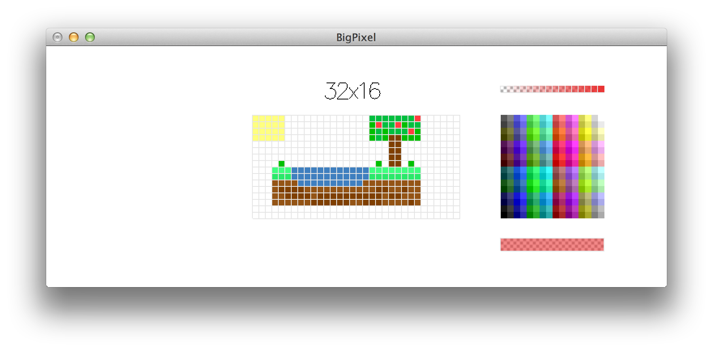

BigPixel
========

BigPixel is an image editor for pixel art. It is aimed at creating graphics assets for retro or Minecraft-style 2D games. It supports the creation of pixelated images with 8x8 big pixels in 256 colours with 16 levels of transparency. It is an OpenGL-based cross-platform application. BigPixel currently only supports the BMP image format.

As BigPixel is a plain OpenGL application without platform-specific GUI support, you need to start it as a command line program and supply it with the name of a BMP image file as its sole command line argument. If the file exists, it will be opened for editing; otherwise, a new file will be created. All changes made to an image are persistent — i.e., reflected in the on disk image without explicit saving.

    Left mouse button          — draw with current colour
    Left mouse button + Shift  — erase with transparency
    Right mouse button         — erase with transparency
    'W', 'S', 'A', 'D'         — enlarge canvas to the top, bottom, left, and right, respectively
    'W', 'S', 'A', 'D' + Shift — shrink canvas from the top, bottom, left, and right, respectively

**WARNING:** There is currently no undo facility! Make copies of image files if you are unsure whether you like to keep the changes. (However, if you shrink the visible canvas, the removed content can be restored by simply enlarging the canvas again.)

Installation
------------

You need to have the Glasgow Haskell Compiler to compile from source. It is available as part of the [Haskell Platform](http://www.haskell.org/platform/).

To install the current release of BigPixel from [Hackage](http://hackage.haskell.org/packages/hackage.html), simply execute

    % cabal install BigPixel

To install the current version from GitHub, 

    % git clone https://github.com/mchakravarty/BigPixel.git
    % cd BigPixel
    % cabal install

Hacking
-------

The Haskell code is relatively simple on purpose. It is part of an effort to teach programming to children. Contributions are most welcome, but please keep them in this spirit.
